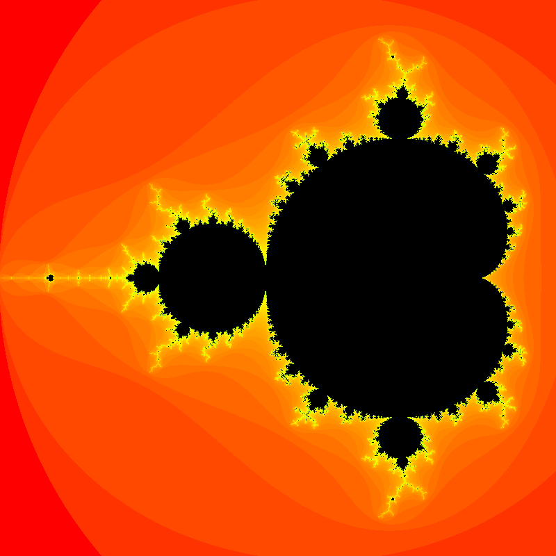
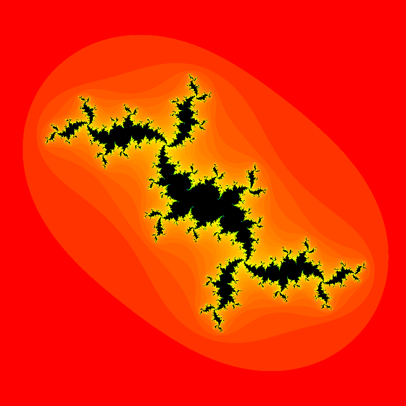
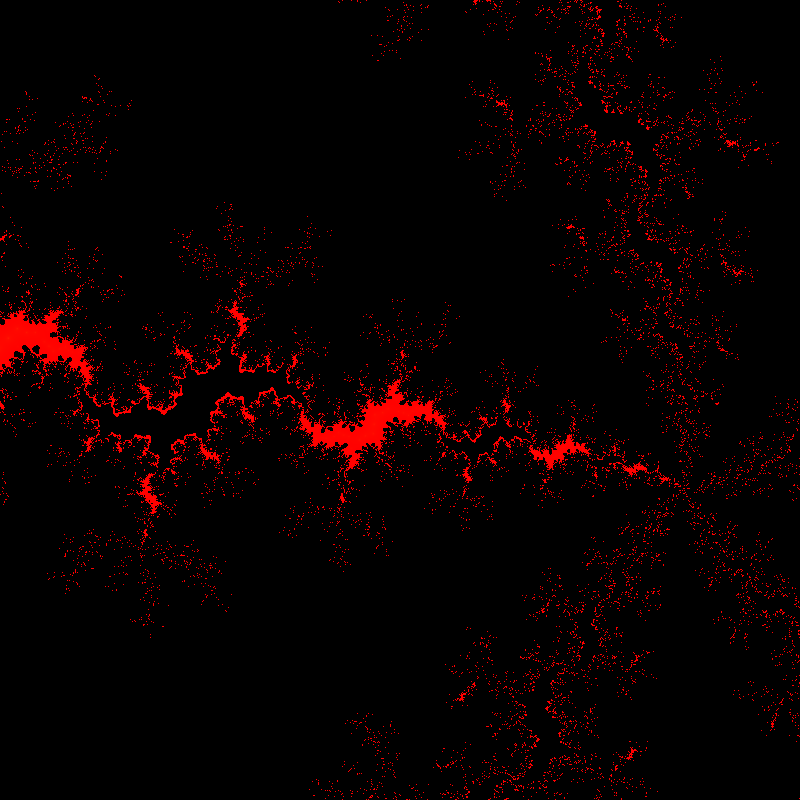
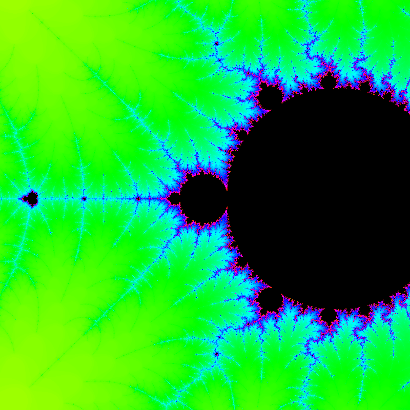
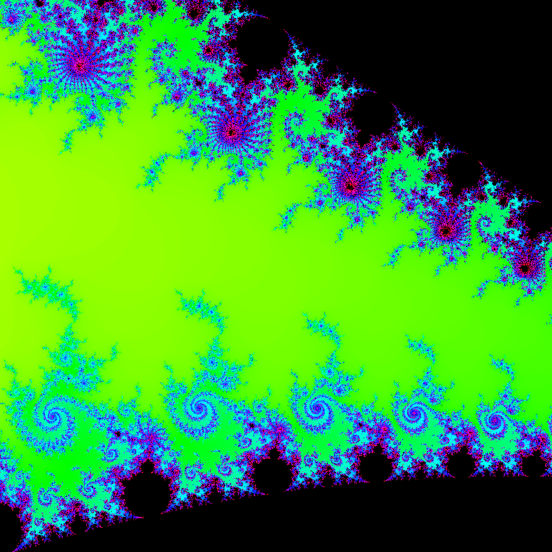
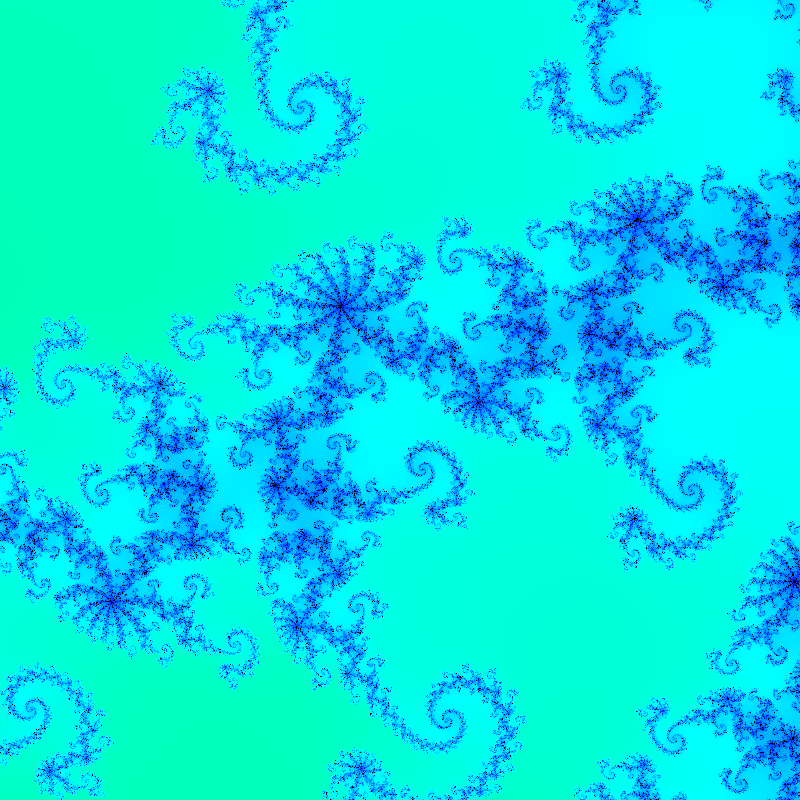
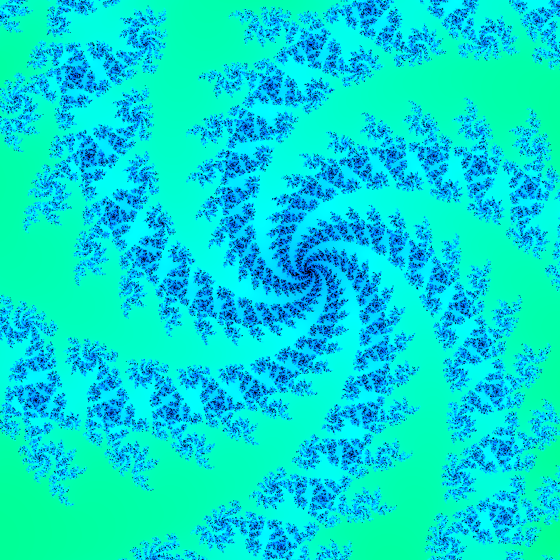
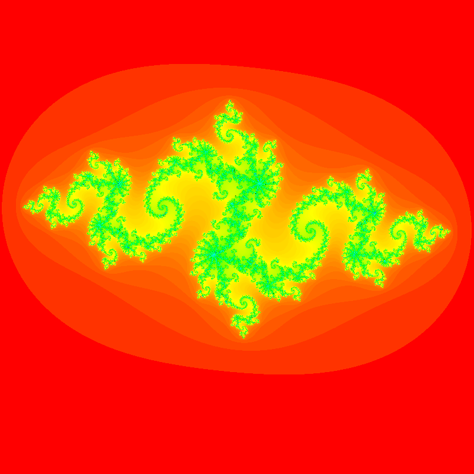

# Mandelbrot and Julia sets

## The Project

This goal of this project is to render the Mandelbrot and Julia sets. I made two versions : on GPU and on CPU. 

## How to use

### The CPU simulation

This simulation uses Python3 and C++. The python library are tqdm, PIL. You can download them with `pip3 install tqdm pillow`.
Compile the C++ library with `g++ -c -fPIC CPU/library.cpp -o CPU/library.o && g++ -shared -o CPU/library.so CPU/library.o`.
Run the python with `python3 CPU/Julia.py`.
Altenatively, you can compile and run python in the same time with : `g++ -c -fPIC CPU/library.cpp -o CPU/library.o && g++ -shared -o CPU/library.so CPU/library.o && python3 CPU/Julia.py`

You can use three differents modes of rendering : Python, C or C_COLOR. C color do more calcul in C than the C mode. 

### The GPU simulation
This simulation uses Processing. You can download the Processing application [here](https://processing.org/download). `GPU.pde` is the layout and manage UI. `shader.glsl` calculate the color of each pixel. 

Keyboard actions :
- Arrows : move view
- `:` and `=` : zoom or dezoom
- `l` and `m` : progressive zoom
- `o` and `p` : increase or decrease number of itterations
- `;` : change display mode (Mandelbrot, Julia or JuliaSDF)
- `alt` : reset scene

## How it's work

### Computation

To compute the fractales, I use C++ and GLSL. Those two programs do basicly the same thing, but GLSL run the calculation in parallel for each pixel, witch is faster than C++. The calculation are detailes in the next parts. 

### Mandelbrot Set

We define $c$ a complex number for each pixel, depending of zoom and position of camera. We define the sequence $z_0 = 0$ and $z_{n+1}=z^2+c$. The color represents the number of iterations needed to diverge (ie $\lvert{z_n}\rvert>2$). 

### Julia Set

The Julia set is similar to the Mandelbrot set, but now $z_0$ is the position on the screen and $c$ is predetermined.

### Julia Set by SDF

This is only available on for GPU. 

An SDF is a signed distance function. This algorithm tries to calculate the distance to the Julia set. 

To compute this distance, we compute the $z_n$ sequence, and at same time its derivative. So we get $dz_{n+1} = 2 \times z \times dz $. With this derivative, we can calulate something called the Hubbard-Douady potential $ G_c(z_0) $. We can use this potential to approximate the distance $d_c = \frac{G_c(z_0)}{\nabla G_c(z_0)}$. In our case, we get $d_c =  \lvert{z_n}\rvert  \frac{\log{\lvert{z_n}\rvert}}{ \lvert{dz_n}\rvert} $. You can find more explanations [here](https://iquilezles.org/articles/distancefractals/).

## Some Pictures

